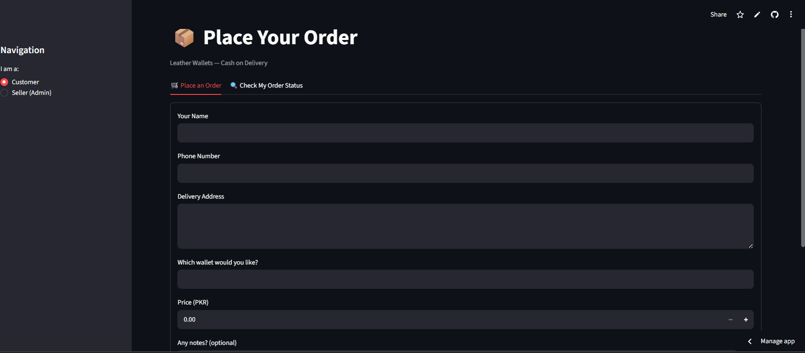
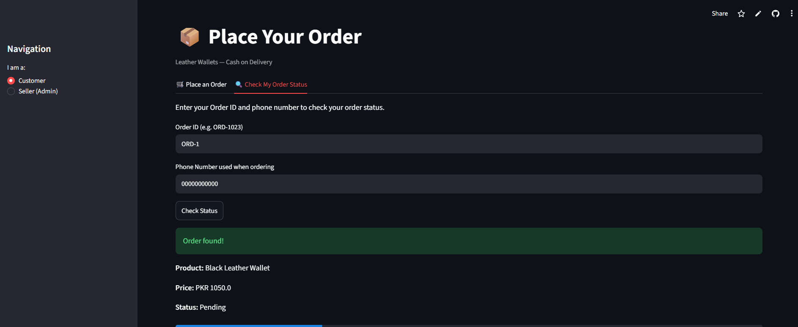
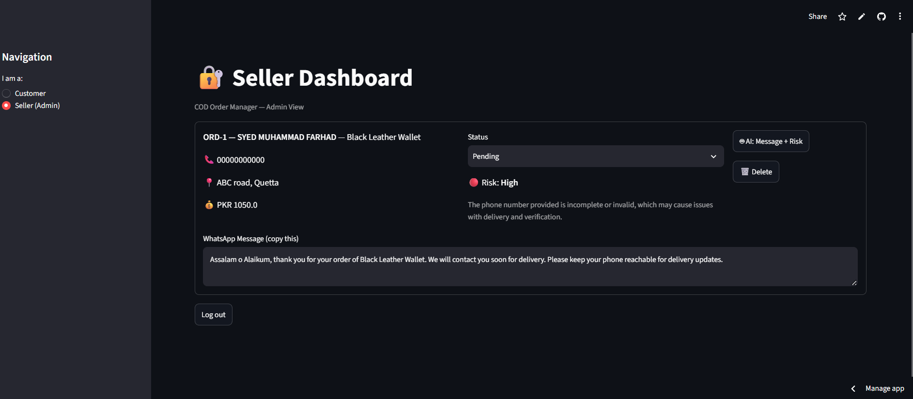

# cod-order-manager

A lightweight order management app for small Instagram/WhatsApp sellers who operate on a Cash on Delivery (COD) model.

## The Problem

Small COD sellers — like independent Instagram/WhatsApp shop owners — usually track orders manually through chat threads and memory. This leads to real, recurring problems:
- Orders get lost or forgotten in DMs
- No clear way to see what's Pending vs Shipped vs Delivered
- Fake/prank orders and no-shows waste time and delivery cost
- Sellers retype the same confirmation messages by hand for every customer

**COD Order Manager** solves this for small sellers (like my own leather wallet business) by giving them a simple dashboard to track every order's status, while customers get a safe, self-service way to check on their own order — without ever seeing anyone else's data.

## 🔗 Live App

https://cod-order-manager-ao7gvpb9cdw9xanhf8wvz9.streamlit.app/

## Features

**Customer view (public):**
- Place an order through a simple form (name, phone, address, product, price, notes)
- Instantly receive a unique Order ID after placing an order
- Check order status anytime using Order ID + phone number (privacy-protected — a customer can only see their own order, never anyone else's)
- Visual progress bar showing order stage: Pending → Confirmed → Shipped → Delivered

**Seller view (password-protected):**
- Dashboard showing all orders with full customer details
- Update any order's status with a dropdown
- Delete orders
- AI-powered tools per order (see below)
- Simple password login to keep the dashboard private

## 🤖 AI Feature

Each order in the Seller Dashboard has an **"AI: Message + Risk"** button, powered by **Groq's LLaMA 3.3 70B model**. Clicking it does two things at once:

1. **Auto-drafts a WhatsApp confirmation message** for the customer, in a polite tone, confirming the order and asking them to stay reachable for delivery.
2. **Assesses order risk** (Low / Medium / High) — flagging orders that look likely to be fake, a prank, or likely to fail delivery, based on signs like an incomplete address, suspicious phone patterns, or missing details.

### System Prompt Used


```You are an assistant for a small online seller in Pakistan who sells leather wallets via Cash on Delivery (COD). You will be given order details: customer name, phone, address, product, price, and notes. You must respond in this exact format, nothing else: MESSAGE: <a short, polite WhatsApp confirmation message, under 4 sentences, confirming the order and asking the customer to keep their phone reachable for delivery> RISK_LEVEL: <Low, Medium, or High> RISK_REASON: <one short sentence explaining the risk level, based on things like incomplete address, suspicious/repeated phone number patterns, missing notes, or generic/placeholder-looking names>```

This prompt was written specifically for this app's use case — it directly reflects the real risks small COD sellers face (fake orders, wasted delivery costs).

## 🛠️ Tools & Technologies Used

- **Frontend/Framework:** Streamlit (Python)
- **Database:** SQLite (local file-based database)
- **AI Model:** Groq API — LLaMA 3.3 70B Versatile
- **Language:** Python 3
- **Version Control:** Git & GitHub
- **Deployment:** Streamlit Community Cloud
- **Secrets Management:** python-dotenv (local) / Streamlit Secrets (cloud)

## 📸 Screenshots

### Customer — Placing an Order


### Customer — Checking Order Status


### Seller Dashboard with AI Message + Risk Assessment


## 💻 How to Run This Project Locally

1. Clone the repository:

`git clone https://github.com/FarhadAgha/cod-order-manager.git`
   `cd cod-order-manager`

2. Create and activate a virtual environment:
   `python -m venv venv`
   `venv\Scripts\activate`

3. Install dependencies:
   `pip install -r requirements.txt`

4. Create a `.env` file in the project root with:
   `GROQ_API_KEY=your_groq_api_key`
   `SELLER_PASSWORD=your_chosen_password`

5. Run the app:
   `streamlit run app.py`

6. Open `http://localhost:8501` in your browser.

## 👤 Author

Syed Farhad — Final year BS Computer Science (AI & Data Science), University of Balochistan.
